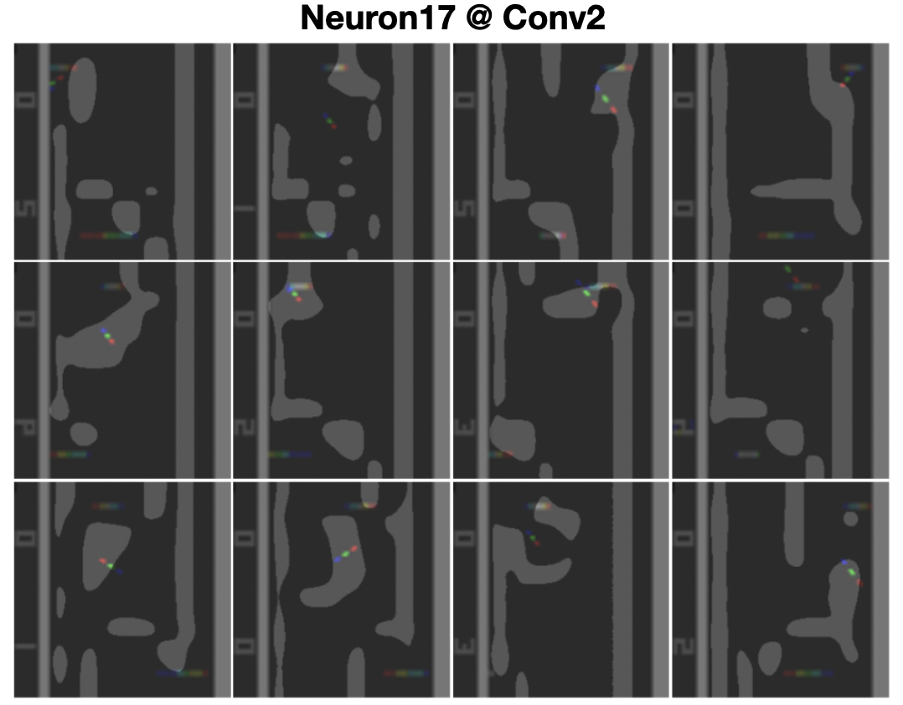
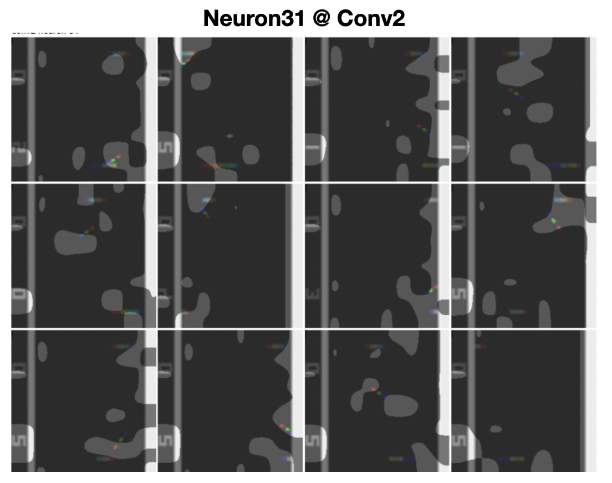
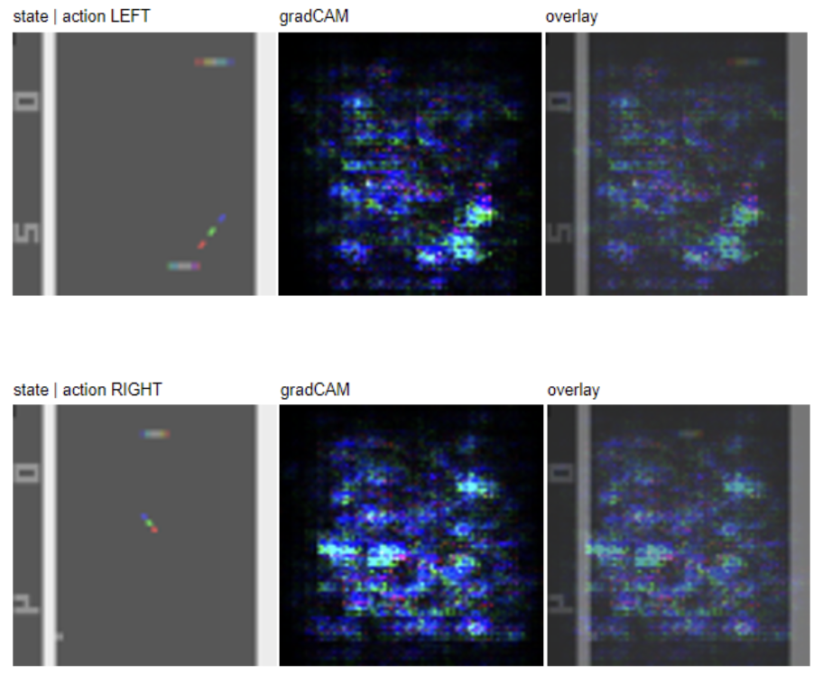

# How can Deep-Q-Networks play Atari Ping-Pong?
### [[PAPER]](https://github.com/rohitgandikota/interpret-dqn/blob/main/interpret_dqn.pdf)    |    [[Train Code]](https://github.com/rohitgandikota/interpret-dqn/tree/main/train-code)    |    [[Pre-Trained Weights]](https://github.com/rohitgandikota/interpret-dqn/tree/main/models)    |    [[DQN Intepretation Code]](https://github.com/rohitgandikota/interpret-dqn/blob/main/visualize_dqn.ipynb)

## Introduction
Deep neural networks are one of the widely used function approximators in reinforcement learning. However, they remain a black box tool to approximate the Q values for state-action pairs. In this work, we attempt to dissect the deep Q networks to interpret their ability to play Atari games at a human level. Understanding DQNs will open up possibilities to debug and design improved solutions in the field of reinforcement learning. Interpretability can also help in better decision-making in RL as the designers can understand the weak-point in the design.  
In this work, we dissect the deep neural network that is trained using Q-learning to play Ping-pong-v4 and visualize the importance of each neuron in decision-making. It is observed that certain neurons tend to actively look at the ping pong ball while some neurons kept a check on the opponent's scores. We also observed that the network does a cost-risk analysis based on the visual scores present in the frame of the Atari games before making a decision. To understand the importance of the input pixels, we also looked at the back-propagated gradients at the input and found that the ping pong ball was the most important part of the input image followed by the racquets and then the scores to make a decision.

## Dissecting DQN models
We dissect the neurons of a trained DQN model that can play Atari PingPong-v4. We find that neuron 17 in Conv layer 1 looks at the ball and raqcuets all the time. 

 

We dissect the neurons of a trained DQN model that can play Atari PingPong-v4. We find that neuron 17 in Conv layer 2 looks at the boundaries of the game so as to anticipate the bounce

We also see that Neuron 31 in Conv layer 2 has a track of the agents own score.

## Smooth Grad

We also look at the gradients at the perturbed inputs to understand the important pixels that are responsible for the decision making by the DQN agent. We find that the regions with the ball and the racquets are the most important as an average.

